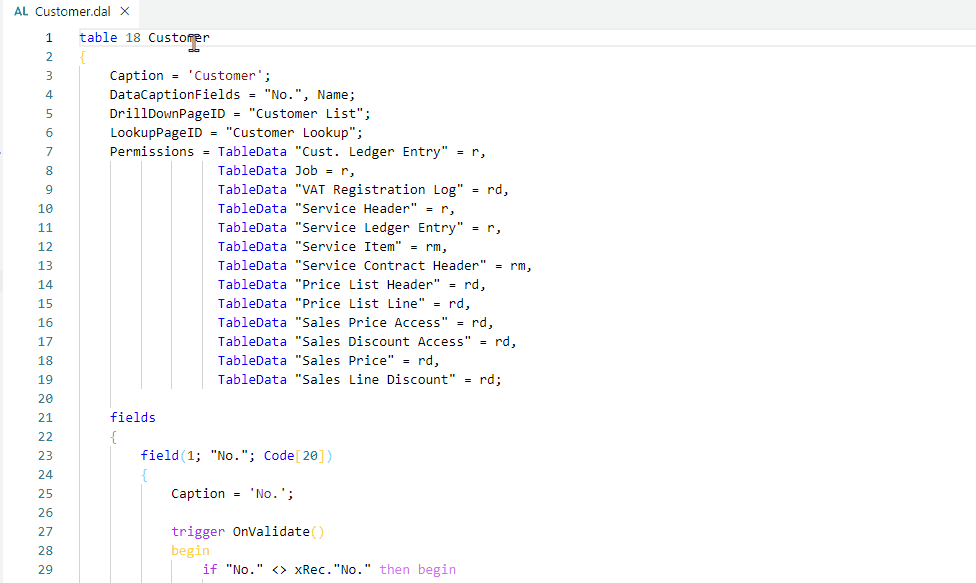
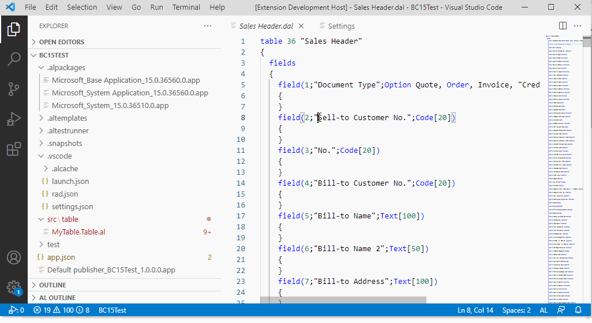
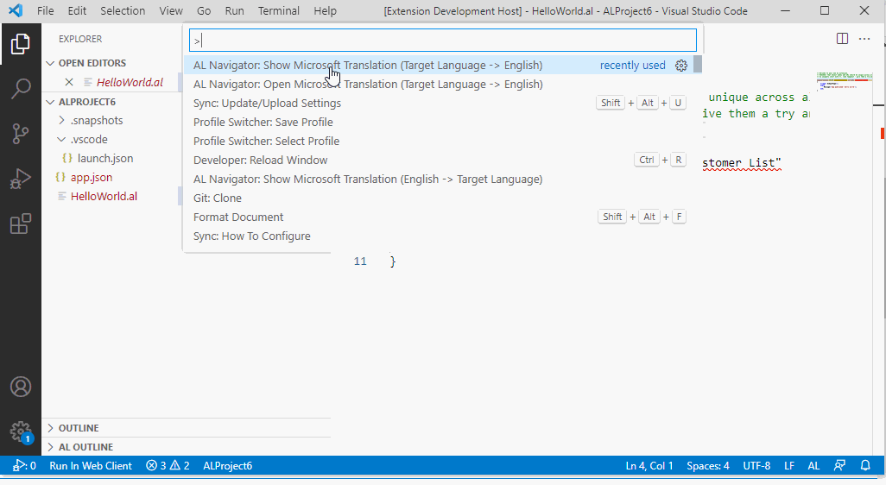
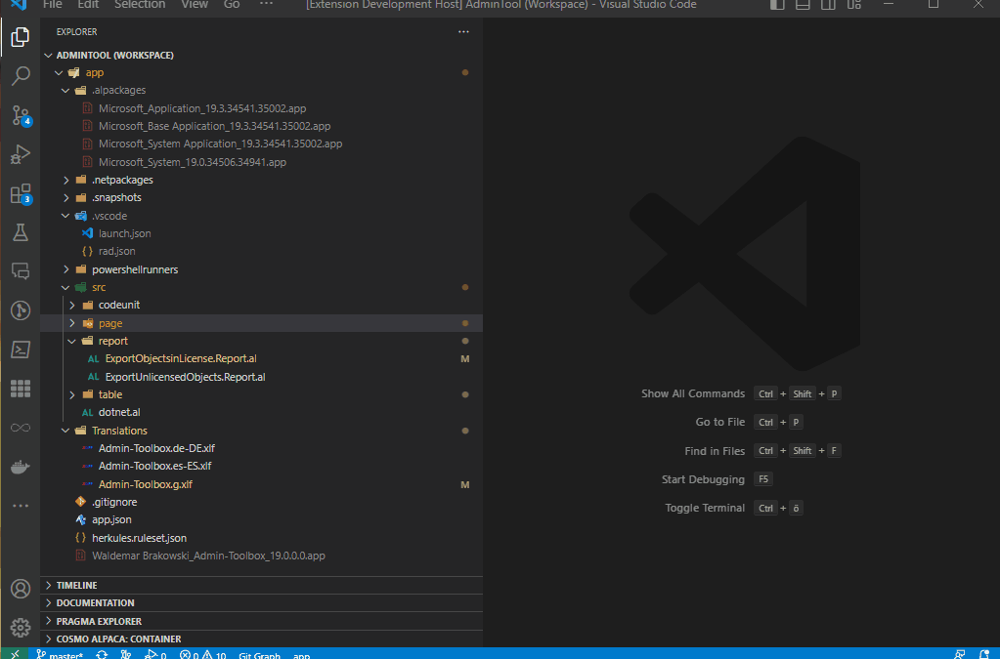
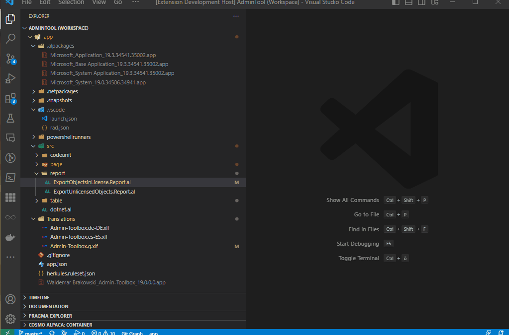
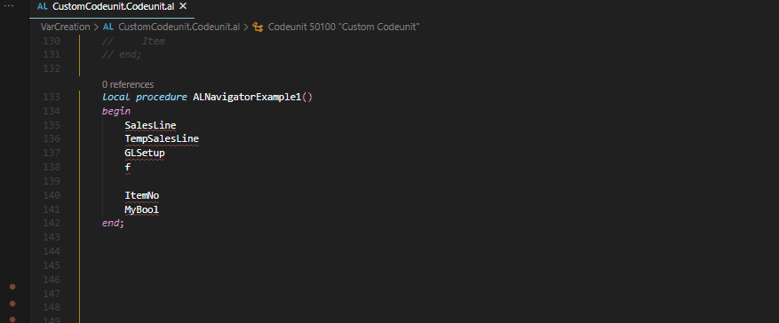
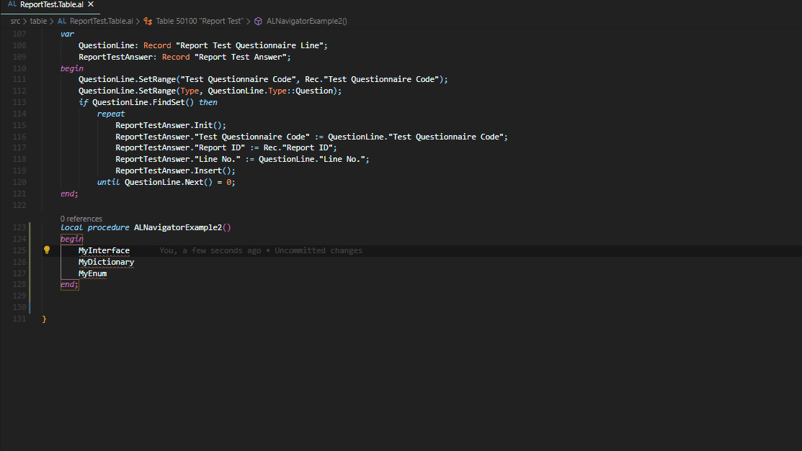
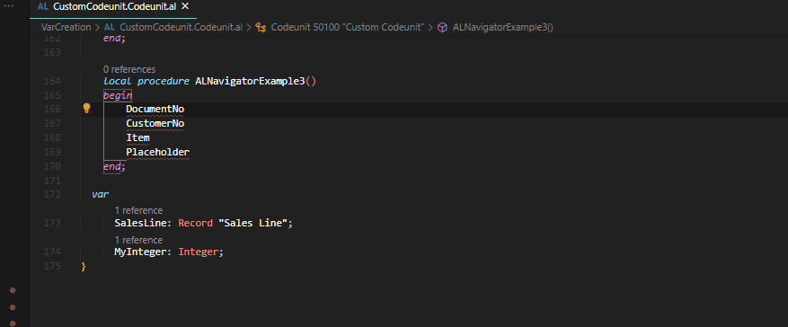

# AL Navigator

**Simplify your AL development workflow:**  
Create variables and parameters like a pro. Automatically select/insert startup object IDs in your launch.json file. Effortlessly navigate through AL files with intuitive shortcuts. Translate fields on hover and streamline report copying – all in one powerful extension.

[](https://www.typescriptlang.org/)  
[](https://marketplace.visualstudio.com/items?itemName=wbrakowski.al-navigator)  
[](https://marketplace.visualstudio.com/items?itemName=wbrakowski.al-navigator&ssr=false#review-details)  
[](https://marketplace.visualstudio.com/items?itemName=wbrakowski.al-navigator&ssr=false#version-history)  

---

## 🚀 Features

### 🔥 New: Smart Variable Ordering
Variables are now automatically inserted in the correct position according to **Microsoft's AL Language specification**:

**Automatic Type-Based Sorting:**
- Complex object types are listed first: Record, Report, Codeunit, XmlPort, Page, Query
- System types follow: Notification, BigText, DateFormula, RecordId, RecordRef, FieldRef, FilterPageBuilder
- Simple types (Integer, Text, Boolean, etc.) appear after sorted types
- Maintains clean, standards-compliant code structure

**Key Benefits:**
- 📋 **Standards Compliance**: Follows Microsoft's official AL coding guidelines
- 🎯 **Better Readability**: Variables grouped by type are easier to scan and understand
- ✨ **Zero Effort**: Automatic sorting - no manual reorganization needed
- 🔧 **Works Everywhere**: Applies to both global and local variable sections

**Example:**
When you add an `Integer` variable to a section that already contains a `Record`, the Integer is correctly placed after the Record, not at the end of all variables. This ensures your code always follows AL best practices.

---

### 🔥 New: Analyze and Optimize Reports
Analyze and optimize your reports and report extensions from both AL and RDL/RDLC files with a unified, intelligent analyzer:

**One command, multiple analyses:**
- **📊 Analyze All**: Run all checks at once for a comprehensive report health check
- **🔤 Font Analysis**: Find non-Segoe UI fonts (intelligently preserves barcode fonts)
- **⚠️ Expression Analysis**: Detect irregular RDL expressions (e.g., `Code.GetData` without parameters)
- **🗃️ Dataset Analysis**: 
  - Find unused columns in AL dataset (not used in layout)
  - Identify missing fields (referenced in layout but not defined in AL)
  - View complete usage statistics

**Smart File Detection:**
- Run from **AL report files and report extensions**: Automatically finds and analyzes associated layout files
- Run from **RDL/RDLC files**: Automatically locates corresponding AL file for dataset analysis
- Handles reports with multiple layout files
- For **report extensions**: Checks the base report to determine if it's processing-only

**Auto-Fix Capabilities:**
- Fix fonts with one click (replace with Segoe UI)
- Correct irregular expressions automatically
- Remove unused variables from AL dataset
- Multi-select which fixes to apply

**Processing-Only Report Detection:**
- Automatically detects processing-only reports (reports without visual layouts)
- For report extensions, checks the base report to determine processing-only status
- Shows informative message when layout analysis is not available

Example Workflow:
1. Open an AL report file, report extension, or RDL/RDLC layout file
2. Run command: `AL Navigator: Analyze and Optimize Report`
3. Select analysis type (All, Fonts, Expressions, or Dataset)
4. Review detailed results in the output panel
5. Choose which issues to auto-fix

---

### 🔥 New: Select Startup Object with Status Bar & Recently Used
Instantly switch startup objects with a single click from the status bar!

**Status Bar Button:**
- **🚀 Rocket icon** shows your current startup object with name (e.g., "🚀 Page 9305: Sales Order List")
- Click to open the unified startup object selection
- Displays full object information: type, ID, and name
- Object name is cached in launch.json for fast loading
- Automatically updates after switching

**Selection Options (in one unified command):**
1. **📄 Current Object**: Instantly use the currently open Page or Report
   - Only shown when a Page or Report is currently active
   - No searching needed - just one click

2. **📜 Recently Used** *(New!)*: Your 10 most recently used startup objects
   - Sorted by most recent first
   - Shows time ago (e.g., "5m ago", "2h ago", "3d ago")
   - Perfect for switching between objects you're actively developing
   - Automatically tracked with every selection

3. **⭐ Popular Objects**: Quick access to 35 commonly used Business Central pages
   - **Sales**: Quote, Order, Invoice, Credit Memo (Lists & Cards), Customer List/Card
   - **Purchase**: Quote, Order, Invoice, Credit Memo (Lists & Cards), Vendor List/Card  
   - **Inventory**: Item List/Card
   - **Finance**: G/L Entries, General Journal, Chart of Accounts
   - **Administration**: Company Information, User Setup, Job Queue Entries

4. **📋 All Objects**: Browse all pages and reports from your workspace and .app files
   - **Smart filtering**: Excludes previous versions of your own app from the list
   - **Duplicate handling**: Shows only the latest version when multiple versions of the same dependency app exist
   - **Cleaner selection**: Significantly improved readability for multi-app workspaces

**Multi-Launch.json Support:**
- When your workspace contains multiple launch.json files (e.g., in different folders), you can:
  - Select which launch.json files to update
  - Or enable the setting `alNavigator.updateAllLaunchJsons` to automatically update all files without prompting

**Multi-Configuration Support:**
- When your launch.json has multiple configurations (e.g., for different containers), you can:
  - Select which specific configurations to update with a unified multi-select dialog
  - All configurations from all selected launch.json files are shown together with clear file path indicators
  - Or enable the setting `alNavigator.updateAllLaunchConfigurations` (default: true) to automatically update all configurations without prompting

**Configuration Settings:**
- `alNavigator.updateAllLaunchJsons` (default: false) - Automatically update all launch.json files without prompting
- `alNavigator.updateAllLaunchConfigurations` (default: true) - Automatically update all configurations within selected launch.json files

**Additional Features:**
- Persistent tracking across VS Code sessions
- Comprehensive logging to AL Navigator output channel for troubleshooting
- Improved workflow: Select object first, then launch.json files, then configurations
- Finds launch.json in nested folder structures
- Status bar updates automatically after switching

**Example Workflows:**
1. **Ultra-Quick**: Click 🚀 → "Recently Used" → Select → Done!
2. **Current Object**: Open a Page/Report → Click 🚀 → "Current Object" → Done!
3. **Multi-File**: Click 🚀 → Select object → Choose which launch.json files → Select configurations
4. **Full Auto**: Enable both settings → Click 🚀 → Select object → Done! (All files and configs updated automatically)
5. **Command Palette**: `AL Navigator: Select Startup Object ID` → Choose source → Select

---

### ⚡ Shortcuts for Quick Navigation
Save time with keyboard shortcuts for essential navigation commands:

| Shortcut        | Command Name                                       | Description                                              |
| --------------- | -------------------------------------------------- | -------------------------------------------------------- |
| **Ctrl+Alt+g**  | AL Navigator: End of global variables              | Moves cursor to the end of your global variables.        |
| **Ctrl+Alt+l**  | AL Navigator: End of local variables               | Moves cursor to the end of your local variables.         |
| **Ctrl+Alt+k**  | AL Navigator: Keys                                 | Moves cursor to the keys in your .al table file.         |
| **Ctrl+Alt+a**  | AL Navigator: Next Action                          | Moves cursor to next action in a page .al file.          |
| **Ctrl+Alt+d**  | AL Navigator: Next DataItem (starting from top)    | Moves cursor through data items in your .al report file. |
| **Shift+Alt+d** | AL Navigator: Next DataItem (starting from bottom) | Moves cursor through data items in your .al report file. |

### Rename Columns (Variables) in AL and RDLC Files
Effortlessly rename column variables in your AL report files and synchronize changes in associated RDLC files:

- Renames columns (variables) both in the AL file and their corresponding definitions in the RDLC file.
- Ensures consistency across `Field Name` and `DataField` in RDLC datasets.

Example Workflow:
1. Place your cursor on a variable inside a `column` definition within a `dataitem` block in a report.
2. Trigger the rename functionality via the Command Palette (`AL Navigator: Rename report dataitem column`).
3. Watch as the variable is renamed in both the AL file and the associated RDLC file.

---

### Insert Translations into XLIFF Files
Effortlessly insert translations directly into XLIFF files:  
- Automatically matches translation values with `note` tags.  
- Updates the `target` element for the corresponding `source` only if the translation exists.  
- Supports **10 common Business Central languages**.  

This feature helps you maintain consistency across multilingual projects without altering the structure of your XLIFF documents.

---

### 🌐 Hover Translations
Translate field names and table names effortlessly:  
- **Hover over symbols** (field names, table names, etc.) to see translations.  
- Switch between English ↔ Target Language with a click.  

  
  
  

---

### 📑 Copy Reports Including Layout
Duplicate reports and layouts in seconds:  
- Copy an entire report, including its layout.  
- Create report extensions with layouts pre-integrated.  
- **🔥 New:** Intelligent folder detection - automatically finds and offers `reportextension` folders when creating report extensions
- **🔥 New:** Support for processing-only reports - successfully copy reports without layout files (e.g., batch processing reports)
- Works with both layout-based reports and processing-only reports

  
  

---

### 🤖 Intelligent Variable and Parameter Creation
Add variables and parameters with a few keystrokes:  
- **Ctrl + .** triggers a quick fix lamp for AL0118 errors.  
- Automatically generate local/global variables or parameters with suggested names.

#### Examples:
- Create **local variables**:  
    

- Create **global variables**:  
    

- Create **parameters**:  
    

#### 💡 Tips for Using This Feature
| Tip                                                                                                                                                                                                                      | Example                                                                                                                                 |
| ------------------------------------------------------------------------------------------------------------------------------------------------------------------------------------------------------------------------ | --------------------------------------------------------------------------------------------------------------------------------------- |
| Variables are **automatically sorted** by type according to AL Language specification (Record, Report, Codeunit, etc. first, then simple types).                                                                         | A new Integer variable is placed after Records but before the end of the var section.                                                   |
| Use Microsoft’s [naming conventions](https://docs.microsoft.com/en-us/dynamics365/business-central/dev-itpro/compliance/apptest-bestpracticesforalcode#variable-and-field-naming "naming conventions") for object names. | "Vendor" is recognized as Record "Vendor".                                                                                              |
| Use the **Temp** prefix to create temporary record variables.                                                                                                                                                            | "TempItem" is recognized as a temporary Record "Item".                                                                                  |
| Use [Microsoft's suggested abbreviations](https://community.dynamics.com/nav/w/designpatterns/162/suggested-abbreviations "Microsoft's suggested abbreviations").                                                        | "GLSetup" is recognized as Record "General Ledger Setup".                                                                               |
| Replace placeholders like "x" with automatically generated variable names.                                                                                                                                               | Replace "x" with "SalesLine" when "Sales Line" is the selected record.                                                                  |
| Customize ignored prefixes and suffixes for variable names in settings.                                                                                                                                                  | Set `"alNavigator.ignoreALPrefix": "EX"`. For a table named "EX Test Table," the variable "TestTable" will be automatically recognized. |

---

## 📜 Full Functionality List

| **Command**                                                                           | **Description**                                                                                                                                                                                           |
| ------------------------------------------------------------------------------------- | --------------------------------------------------------------------------------------------------------------------------------------------------------------------------------------------------------- |
| **AL Navigator: Analyze and Optimize Report**                                         | Comprehensive report and report extension analysis: fonts, expressions, and dataset variables (works from both AL and RDL/RDLC files, with processing-only report detection).                             |
| **AL Navigator: Insert translation from comment into xlf file**                       | Inserts the comment with the translation in the `target` elements in XLIFF files.                                                                                                                         |
| **AL Navigator: Select Startup Object ID in launch.json** *(Enhanced!)*               | 🚀 Status bar button + unified selection with multi-launch.json and multi-configuration support. Recently Used, Popular Objects & All Objects with smart filtering. Comprehensive settings for automation. |
| **AL Navigator: Rename report dataitem column**                                       | Rename variables in AL files and their corresponding RDLC files.                                                                                                                                          |
| **AL Navigator: Next DataItem (starting from top)**                                   | Navigate to the next `DataItem` in your AL report file, starting from the top.                                                                                                                            |
| **AL Navigator: Next DataItem (starting from bottom)**                                | Navigate to the next `DataItem` in your AL report file, starting from the bottom.                                                                                                                         |
| **AL Navigator: Keys**                                                                | Quickly move to the keys section in your `.al` table file.                                                                                                                                                |
| **AL Navigator: Next Action**                                                         | Navigate to the next action in your AL page file.                                                                                                                                                         |
| **AL Navigator: End of local variables**                                              | Jump directly to the end of the local variables section in your file.                                                                                                                                     |
| **AL Navigator: End of global variables**                                             | Jump directly to the end of the global variables section in your file.                                                                                                                                    |
| **AL Navigator: Show Microsoft Translation (English -> Target Language)**             | Display the translation of a field or symbol from English to the target language.                                                                                                                         |
| **AL Navigator: Show Microsoft Translation (Target Language -> English)**             | Display the translation of a field or symbol from the target language to English.                                                                                                                         |
| **AL Navigator: Show translation and copy to clipboard (English -> Target Language)** | Display the translation and copy it directly to your clipboard.                                                                                                                                           |
| **AL Navigator: Create a new report**                                                 | Easily create new reports, including layouts and necessary definitions.                                                                                                                                   |

---

## ⚙️ Settings

### AL Navigator Settings
| Setting                                     | Description                                                                                                                      |
| ------------------------------------------- | -------------------------------------------------------------------------------------------------------------------------------- |
| `alNavigator.ignoreALPrefix`                | Removes prefixes from suggested variable names.                                                                                  |
| `alNavigator.ignoreALSuffix`                | Removes suffixes from suggested variable names.                                                                                  |
| `alNavigator.translationTargetLanguage`     | Defines the target language for hover translation display and translation commands (not used for startup object translations).   |
| `alNavigator.maxNoOfShownTranslations`      | Sets the maximum number of translations displayed.                                                                               |
| `alNavigator.enableHoverProviders`          | Enables hover translations for target languages on symbols (field names, etc.). Requires a reload.                               |
| `alNavigator.updateAllLaunchConfigurations` | When enabled, updates all configurations in launch.json without prompting. When disabled (default), select which ones to update. |
| `alNavigator.updateAllLaunchJsons`          | When enabled, automatically updates all launch.json files in the workspace. When disabled (default), prompts for file selection. |

### AL Language Settings (for custom .alpackages folder)
AL Navigator fully supports the AL Language extension's custom package cache path configuration:

| Setting               | Description                                                                                                        | Example                                                      |
| --------------------- | ------------------------------------------------------------------------------------------------------------------ | ------------------------------------------------------------ |
| `al.packageCachePath` | Specifies custom paths for .alpackages folder(s). Supports absolute paths, relative paths, and multiple locations. | `["./.alternativePackages"]` or `["C:\\SharedPackages\\BC"]` |

**Usage Example:**
```json
{
  "al.packageCachePath": [
    "./.alternativePackages",
    "C:\\SharedPackages\\BC",
    "../../../CommonPackages/.alpackages"
  ]
}
```

The extension will use the first path that exists. This is particularly useful for:
- Shared network locations for .app files
- Centralized package repositories
- Multi-workspace setups with shared dependencies

---

## 📋 Requirements

| Extension                           |                                                                                                                                                                                                                            |
| ----------------------------------- | -------------------------------------------------------------------------------------------------------------------------------------------------------------------------------------------------------------------------- |
| **AL Language**                     | [](https://marketplace.visualstudio.com/items?itemName=ms-dynamics-smb.al)                                     |
| **AZ AL Dev Tools/AL Code Outline** | [](https://marketplace.visualstudio.com/items?itemName=andrzejzwierzchowski.al-code-outline) |

---

## 💖 Thanks to
- **David Feldhoff** for his contributions and feedback.  
- **Andrzej Zwierzchowski** for providing an awesome API in the AZ AL Dev Tools/AL Code Outline extension.

---

## 🔗 Resources

- [GitHub Repository](https://github.com/wbrakowski/AL-Navigator)  
- [VS Code Marketplace](https://marketplace.visualstudio.com/items?itemName=wbrakowski.al-navigator)  
- [Detailed Blog Documentation](https://navinsights.net/category/al-navigator/)  

---

## 📸 Picture Attribution
[Alpaca Icon](https://vectorified.com/alpaca-icon)
