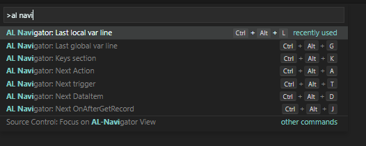

# al-navigator README

Create variables like a boss and navigate through al files with awesome shortcuts.

## Features

- Ctrl + Alt + l: jump to last line of local var section (fast way to    declare new variables)
- Ctrl + Alt + g: jump to the last line of global var section (fast way to declare new variables)
- Ctrl + Alt + k: jump to the keys section in your .al file 
- Ctrl + Alt + a: jump to next action in a page .al file
- Ctrl + Alt + t: jump through all triggers in your .al file 
- Ctrl + Alt + d: jump through data items in your .al report file 
- Ctrl + Alt + j: jump through OnAfterGetRecord triggers in your .al file 

- Ctrl + o + d: jump to the OnDeleteTrigger
- Ctrl + o + m: jump to the OnModifyTrigger
- Ctrl + o + i: jump to the OnInsertTrigger

- Automatic local variable declaration of all standard tables, pages and reports (also objects from workspace files)
- Use the Quick Fix lamp (Ctrl + .) to automatically add variables

- Create procedure stub if procedure call does not exist yet

- UPDATE 04.05.2020: Seems like someone else decided to also build the same feature in a more stable way.
- Check out the extension "AL CodeActions" if you want to automatically create procedures in the future :-)
 

## Known Issues

Currently none.

## Requirements

- AL Language extension for VS Code

## Git Repository

https://github.com/wbrakowski/AL-Navigator

## Picture Attribution
<a href="https://vectorified.com/alpaca-icon">Alpaca Icon</a>