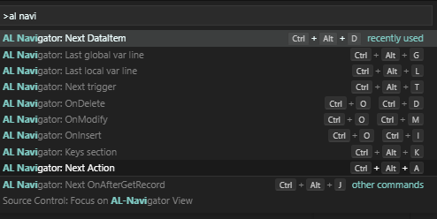

# AL Navigator

Create variables and parameters like a boss. Navigate through al files with awesome shortcuts.

## Features

### Shortcuts

|Shortcut   |Command Name   |Description   |
|---|---|---|
|Ctrl + Alt + g   |AL Navigator:   |jump to end of your global variables (fast way to declare new variables)   |
|Ctrl + Alt + l   |AL Navigator:   |jump to the end of your local variables (fast way to declare new variables)   |
|Ctrl + Alt + k   |AL Navigator:   |jump to the keys in your .al file    |
|Ctrl + Alt + a   |AL Navigator:   |jump to next action in a page .al file   |
|Ctrl + Alt + d   |AL Navigator:   |jump through data items in your .al report file    |
|Shift + Alt + d   |AL Navigator:   |jump through data items in your .al report file    |

### Create Variables

CodeAction for AL0118: Create a local/global variable or a parameter by using the quick fix lamp (Ctrl + .=).

Example 1: Create local variables

Example 1: Create global variables

Example 3: Create parameters

## Requirements

|              |         |
|--------------|---------|
| AL Language               |  |
| AZ AL Dev Tools/AL Code Outline           |  |

## Thanks to
- David Feldhoff for his contributions and feedback
- Andrzej Zwierzchowski for providing such an awesome API for his AZ AL Dev Tools/AL Code Outline extension

## Additional information
The functionality of this extension is constantly evolving.
To not bloat this readme too much, you can find more detailed documentations and details on my blog (https://navinsights.net/category/al-navigator/).

## Git Repository

https://github.com/wbrakowski/AL-Navigator

## Picture Attribution
<a href="https://vectorified.com/alpaca-icon">Alpaca Icon</a>
